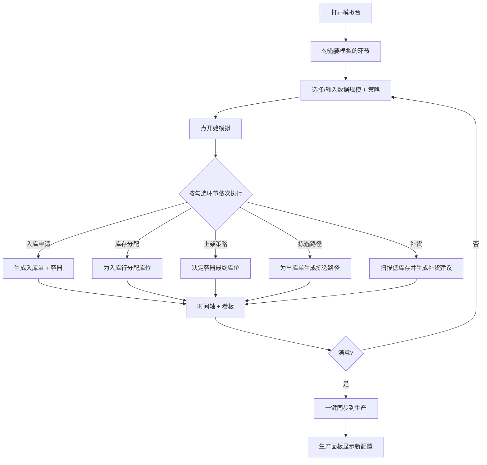

# WMS 精益沙盒模拟台 — 产品需求文档 (PRD)

## 1. 产品概述

WMS（仓库管理系统）的策略调整若直接上生产，可能导致拣选路径变长、库位分配混乱、补货不及时。**精益沙盒模拟台**是一个「按需模拟」的可视化沙盒工具：用户在场景配置面板勾选要模拟的环节（入库申请、库存分配、上架、拣选、补货），系统仅模拟所选环节并即时返回可视化结果，所见即可决定是否「一键同步到生产」。

- **目标用户**：WMS 实施顾问、仓库运营主管、配置管理员
- **核心价值**：用最小数据量、最快速度验证策略效果；不复制生产数据库，零业务风险

## 2. 核心功能

### 2.1 用户角色

本工具无登录注册体系，所有数据均为本地 mock，预设单一身份「**沙盒操作员**」。

### 2.2 功能模块

1. **场景配置台**：勾选模拟环节、设置数据规模、选择策略
2. **模拟执行台**：实时显示所选环节的运行轨迹与结果
3. **结果看板**：库位图、分配表、路径图、指标对比
4. **历史回放**：载入历史数据用当前策略回放，查看效果
5. **一键同步到生产（模拟）**：把当前沙盒配置推送到「生产」面板并对比差异

### 2.3 页面详情

| 页面 | 模块 | 功能描述 |
|------|------|----------|
| 首页 / 模拟台 | 顶部状态栏 | 显示当前环境（沙盒 / 生产）、mock 仓库编号、策略版本 |
| | 左侧场景配置 | 多选环节（入库申请 / 分配 / 上架 / 拣选 / 补货）、数据规模、策略下拉、数据源切换 |
| | 中部运行轨迹 | 时间轴展示每步执行（输入→策略→输出），可展开看每条记录详情 |
| | 右侧结果看板 | 库位网格、分配表（容器×库位）、拣选路径图、指标卡 |
| | 底部操作栏 | 「开始模拟 / 重置 / 一键同步到生产 / 保存为场景模板」 |
| 历史回放页 | 场景列表 | 列出已有历史快照（mock 5 条） |
| | 回放对比 | 选择历史快照 × 当前策略，输出对比指标 |
| 生产同步页 | 差异对比 | 沙盒配置 vs 生产配置，逐项高亮差异，点「同步」后入库到 mock 生产库 |

## 3. 核心流程

## 4. 用户界面设计

### 4.1 设计风格

- **整体定位**：暗色工业控制台（Mission Control）。深蓝灰底 + 琥珀色 + 翠绿强调色，像仓库中控大屏
- **主色**：`#0B0F14`（背景）`#10161D`（面板）`#1A2330`（边框）`#F4A300`（琥珀主操作）`#22D3A4`（翠绿成功）`#FF5C7A`（警示红）
- **辅助**：`#7C8B9A`（次要文字）`#3D4D5C`（禁用态）
- **字体**：标题用 `JetBrains Mono`（等宽、工业感），正文用 `Inter`，数字指标用 `JetBrains Mono` 加粗
- **按钮**：直角 + 1px 边框 + 琥珀色填充（主操作）/ 描边（次操作），无圆角
- **布局**：3 列网格（左配置 / 中轨迹 / 右看板），底部固定操作栏
- **图标**：lucide-react，统一 1.5px 描边
- **动效**：模拟执行时数据流用「打字机 + 进度条」节奏；数字指标 count-up 动画；状态切换用 200ms 颜色过渡

### 4.2 页面设计概览

| 页面 | 模块 | UI 元素 |
|------|------|----------|
| 模拟台 | 顶部状态栏 | 等宽字 + 圆点指示（沙盒=琥珀，生产=翠绿），右上角时钟 |
| | 场景配置 | 复选框卡片（环节图标 + 名称 + 简介），点击展开数据规模输入 |
| | 时间轴 | 左侧时间戳 + 右侧事件卡片，状态色编码（pending/running/done/error） |
| | 库位网格 | 12×8 网格，库位按区着色（收货区/存储区/拣选区/发货区），有库存显示 SKU 缩写 |
| | 拣选路径 | SVG 路径动效，起点/终点高亮，距离标注 |
| | 指标卡 | 大数字 + 单位 + 同比箭头（绿升/红降） |

### 4.3 响应性

桌面优先（1280px+），平板可自适应堆叠为上下结构（配置→轨迹→看板），手机端只读展示（不提供完整操作）。

### 4.4 3D 场景

不适用。
