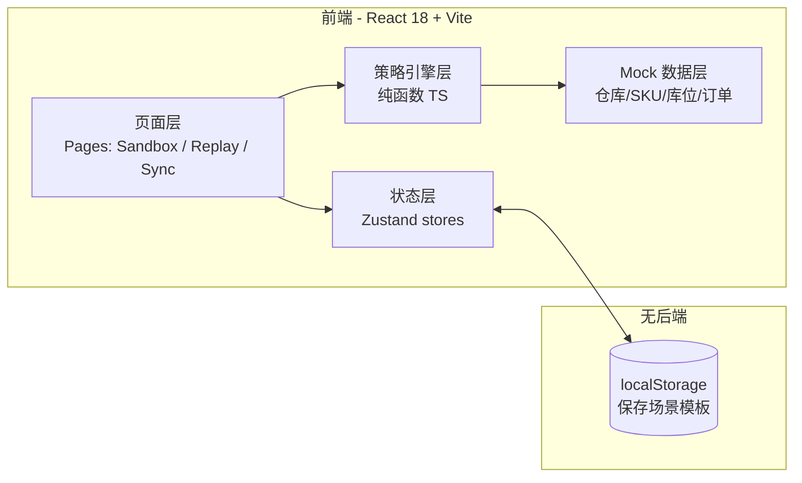
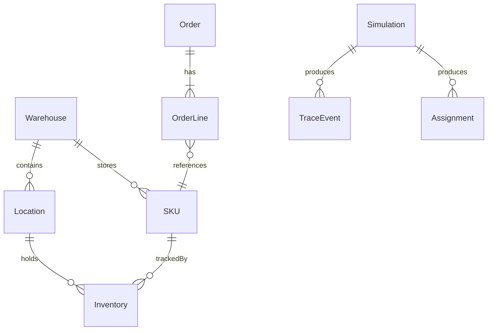

# WMS 精益沙盒模拟台 — 技术架构文档

## 1. 架构设计



## 2. 技术说明

- **前端**：React@18 + TypeScript + Vite
- **样式**：TailwindCSS@3 + CSS 变量定义设计令牌
- **状态管理**：Zustand（场景配置、模拟结果、同步状态）
- **图标**：lucide-react
- **路由**：react-router-dom（/sandbox、/replay、/sync）
- **后端**：无（纯前端 mock，所有数据为 TypeScript 静态生成 + localStorage 持久化）
- **数据**：内置 5 个 mock 仓库、200 个 SKU、96 个库位、20 个历史快照

## 3. 路由定义

| 路由 | 用途 |
|------|------|
| `/` | 重定向到 `/sandbox` |
| `/sandbox` | 模拟台主界面（三栏布局：配置 / 轨迹 / 看板） |
| `/replay` | 历史回放页（选快照 × 策略，看对比） |
| `/sync` | 一键同步到生产（沙盒 vs 生产 差异对比） |

## 4. API 定义

无后端 API。所有「接口」由前端 TypeScript 模块导出：

```typescript
// 策略引擎接口
interface PutawayStrategy {
  id: 'nearest' | 'category' | 'capacity' | 'fifo';
  name: string;
  resolve(items: InboundLine[], locations: Location[]): AssignmentResult[];
}

interface SimulationRequest {
  scope: ('inbound' | 'allocate' | 'putaway' | 'pick' | 'replenish')[];
  scale: { orders: number; skus: number; locations: number };
  strategy: { putaway: string; pick: string; replenish: string };
  dataSource: 'random' | 'historical';
  historicalId?: string;
}

interface SimulationResult {
  trace: TraceEvent[];
  assignments: Assignment[];
  metrics: { utilization: number; pickDistance: number; pickTime: number; anomalies: number };
  timestamp: number;
}
```

## 5. 服务端架构图

不适用（无后端）。

## 6. 数据模型

### 6.1 数据模型定义



### 6.2 数据定义语言（TypeScript Schema）

```typescript
type Warehouse = { id: string; name: string; zoneCount: number };
type Location = { id: string; warehouseId: string; zone: 'INBOUND'|'STORAGE'|'PICK'|'OUTBOUND'; row: number; col: number; capacity: number; occupied: number };
type SKU = { id: string; name: string; category: string; weight: number; volume: number; abcClass: 'A'|'B'|'C' };
type Inventory = { locationId: string; skuId: string; qty: number; batch: string };
type Order = { id: string; type: 'INBOUND'|'OUTBOUND'; lines: OrderLine[]; createdAt: number };
type OrderLine = { skuId: string; qty: number; container?: string };
type Assignment = { orderLineId: string; skuId: string; container: string; locationId: string; distance: number };
type TraceEvent = { ts: number; step: string; status: 'pending'|'running'|'done'|'error'; payload?: unknown };
```

## 7. 策略引擎实现要点

- **入库申请**：随机生成 N 条入库单（orders×lines）
- **库存分配**：遍历入库行，按所选上架策略分配库位
  - `nearest`：选择距离收货区最近的空库位
  - `category`：同品类 SKU 集中分配到相邻库位
  - `capacity`：优先填满低利用率库位
  - `fifo`：按库位编号顺序分配
- **拣选路径**：BFS 求起点→各库位→终点的最短路径，输出 SVG path
- **补货**：扫描所有库存 < 阈值的 SKU，生成补货建议（不进生产库）

## 8. 目录结构

```
src/
  components/        # 通用 UI 组件（Button/Card/Checkbox/Metric/...）
  features/
    sandbox/         # 模拟台主功能
      ScopePicker.tsx
      ScaleForm.tsx
      TraceTimeline.tsx
      LocationGrid.tsx
      PickPath.tsx
      MetricsBar.tsx
    replay/          # 历史回放
    sync/            # 生产同步
  engine/            # 策略引擎（纯函数）
    strategies/
    simulator.ts
  data/              # mock 数据生成器
  pages/             # 路由页面
  stores/            # zustand stores
  styles/            # tailwind + tokens
```
